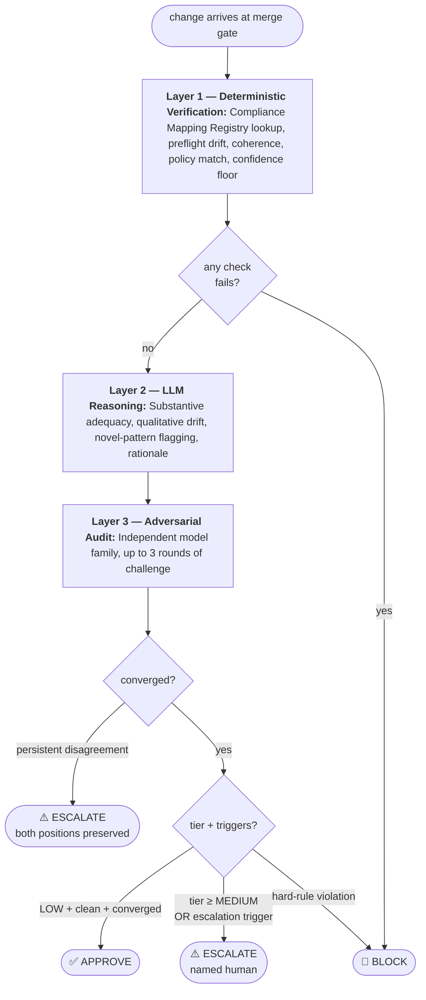

# Take Home Assignment | ERM/TPRM Lead — AI Fluency & Risk Governance

*by Brad Coughlin — bradjcoughlin@gmail.com — 402-477-4105*

---

## Problem Framing and Assumptions

The assignment asks for one agent. The answer below places that agent inside a four-agent compliance program, because a single reviewing agent is the wrong unit of analysis for the problem. The real goal is to shift compliance context *left* — into the spec, into the build, into the data-flow map — so that by the time a change reaches review, most risk has already been designed out. The Compliance Review Agent is the final gate. It is not the main event.

This reframe matters because traditional Enterprise Risk Management is a quarterly, human-paced, spreadsheet-mediated practice. Risk registers refresh on a cadence. Control testing is sampled. Findings age in tracking tools. The structural failure mode is orphaned risk — items identified, owners unassigned or stale, findings closed without remediation, controls documented but not actually operating. PCAOB inspection reports keep flagging the same gaps year after year: 39% of 2024 audits had Part I.A deficiencies, ITGC access and change management remain the most-cited material weakness themes, and the most persistent finding category is lack of contemporaneous evidence that system-generated reports and management-review controls operated as designed. The agentic age does not fix this by adding agents to the existing workflow. It fixes it by inverting the workflow. Context shifts left. Scope becomes continuous and machine-queryable. Review becomes evidence verification, not evidence reconstruction. Audit becomes continuous challenge, not quarterly sampling.

The four Compliance Agents in this program:

- **Compliance Intelligence Agent** — an interactive tool surface the Builder Agent consults pre-build through a mandatory preflight protocol. Builder iterates with Intelligence on scope, risk, precedents, and required evidence before code is written. Detail in the appendix.
- **Compliance Mapping Agent** — synthesizes regulatory guidance into programmatic themes and overlays them onto Gusto's topology, producing the Regulatory Scope Registry that every other agent queries. Detail in the appendix.
- **Compliance Review Agent** — the subject of this assignment. The final compliance gate at merge time.
- **Adversarial Audit Agent** — operates on a different model family than the Compliance Review Agent. Challenges the Compliance Review Agent's draft artifact across up to three rounds before crystallization. Persistent disagreement escalates to a human with both positions preserved. This replicates the internal-audit / external-audit relationship at the agent layer.

These agents are designed to be *epistemically independent*, not merely functionally separate — because that is the failure mode the design is built to avoid. Segregation of duties, blind review, and adversarial challenge are the principles that make human compliance programs trustworthy, and the same principles must govern an agent ecosystem. Agreement among AI agents with shared training is weak signal, because correlated errors from a shared distribution are the dominant failure mode of multi-agent systems. Disagreement is the strong signal. Different model families across adversarial pairs are the structural countermeasure. **A single reviewing agent would be a single point of epistemic failure dressed up as automation.**

A final framing point worth making plainly: the separation between Mapping (which decides scope) and Review (which enforces it) is a velocity and correctness commitment to the product and software teams, not only a segregation-of-duties choice. If the Compliance Review Agent had to re-trace the full system on every change — recomputing scope, re-classifying data flows, re-evaluating control coverage from the code alone — reviews would stack, concurrent changes would produce inconsistent classifications, and the pipeline would grind. Mapping does the expensive work once, continuously, in the background. Review performs a cheap lookup per change. **Compliance becomes something the engineering organization can ship *through*, not around.**

### Design assumptions

1. **Compliance systems of record exist upstream.** The Compliance Mapping Agent federates with Gusto's existing compliance systems of record — control inventory, risk-control matrix, regulatory register, GRC platform — to produce the live, machine-queryable view of scope the other agents consume. Maintaining those systems is a separate program investment, outside this design.
2. **Deterministic compliance checks already run in Gusto's pipeline.** The Compliance Review Agent consumes their outputs as evidence. Engineering owns how those outputs are normalized and delivered.
3. **Human approver capacity is a hard constraint, and reviewer fatigue is the industry's dominant control-failure mode** — 83% of security practitioners admit burnout has caused breach-linked errors.[^1] The program counters this structurally through precision-tuned blocking gates, Adversarial Audit challenge before any artifact reaches a human, and an explicit policy that when High-risk volume exceeds capacity the response is to re-scope through the governance forum — narrowing what counts as High through refined Registry classifications, decomposing overly-broad controls, or shifting detection upstream to the Compliance Intelligence Agent — never to fast-track, batch-approve, or lower the review bar.
4. **The agent ecosystem is itself an AI risk.** It is enrolled in Gusto's TPRM and AI inventory, mapped to NIST AI RMF and ISO/IEC 42001, and documented against EU AI Act high-risk criteria. Each agent maintains an MLBOM (model, prompt version, tool definitions, guardrails, evaluation benchmarks) alongside the SBOM for its runtime, providing the provenance record examiners expect under EU AI Act Article 11 / Annex IV.
5. **Policy configuration is governed, versioned, and calibrated.** Thresholds, non-override rules, and model selections are ratified by a standing cross-functional forum (Compliance, Legal, Security, Engineering). Changes require documented rationale and a policy version bump stamped into every subsequent artifact. The first 90 days post-launch are a calibration window; the forum locks to quarterly cadence thereafter.

---

# Exercise 1 — Design the Compliance Review Agent

## Part A — System Design

### What it does

At merge time, the Compliance Review Agent performs four comparisons:

1. **Findings against regulatory obligations** — scan and SDLC-agent findings compared against SOX, PCI-DSS, GLBA, and EU AI Act requirements for the specific scope.
2. **Change against current system design** — detecting expansions of attack surface, scope, or capability beyond what is documented and approved.
3. **Final implementation against preflight intent** — verifying the change matches the scope Builder declared and the evidence plan it committed to at preflight, or flagging the drift that occurred during build.
4. **Pipeline signals for coherence** — checking that deterministic scans, SDLC-agent findings, and the preflight log tell a consistent story.

**Comparison (3) is the highest-value and least-performed check in traditional compliance workflows.** Design-to-build drift is usually caught months later during internal or external audit, worked backwards from an incident, when the engineer has moved on and context is gone. PCAOB inspections cite this exact gap — controls as documented differ from controls as operated. Catching drift at the moment of decision, with the evidence live and the accountable owner present, is where the shift-left thesis converts into contemporaneous audit evidence.

### What it ingests

From the SDLC pipeline: the change diff, Builder Agent metadata (model identifier with major/minor/patch version, prompt version), and findings from the Code Reviewer, Red Team, and Test Generation agents — findings only, not verdicts (see *Where it sits*). From deterministic CI/CD tooling: secret-scan reports, SBOM delta, IaC policy diff, IAM policy diff, cryptographic commit signatures, test results. From the compliance program: the preflight log from the Compliance Intelligence Agent, and the authoritative scope and applicable-control determination from the Compliance Mapping Agent's Registry. Regulatory scope is never inferred from the diff; it is always read from the Registry.

### What it produces

A signed per-change compliance record that feeds two audit-facing rollups: a control-level attestation (periodic proof the control operated across the full change population, what SOX and SOC 2 auditors sample from) and a program-level dashboard (continuous risk posture for the CCO and Board). Regulators consume these differently — SOX samples, SOC 2 tests consistency, PCI scopes narrowly, GLBA is incident-triggered.

Building only the per-change layer — individual records of each decision — would force every audit to reconstruct population-level evidence from scratch. When an external auditor asks "what percentage of High-risk changes got human approval this year?" or "how many changes were blocked and why?", someone has to write queries, pull spreadsheets, and aggregate across thousands of records under time pressure. That reconstruction work is both expensive and a known PCAOB deficiency pattern: management often cannot produce timely evidence that a control operated across the full period, even when it did. The attestation layer is the continuously-maintained rollup that answers those questions without retroactive assembly.

### Where it sits

After the Code Reviewer, Red Team, and Test Gen agents, because it needs their findings. Before any human gate or deployment action, because its output is the evidence the human gate reviews. Two architectural commitments go beyond sequencing. First, **blind-review ordering**: the same principle that keeps human audit reviews independent — form your conclusion before reading peers' notes — applies here. The reasoning layer sees what upstream agents found but not their confidence scores or pass/fail verdicts, preventing rubber-stamping of optimistically-approved changes. Second, **adversarial challenge before crystallization**: the draft artifact passes to the Adversarial Audit Agent for up to three rounds of challenge. Convergence crystallizes it. Persistent disagreement after three rounds escalates to a human with both positions preserved.

## Part B — Risk-Tiered Escalation Logic

### How the agent assigns risk tier

Risk tier is computed from structured signals, not inferred from the code. The deterministic Layer 1 calls the Compliance Mapping Agent as a tool to resolve the change scope — touched files, database fields, IaC resources, and IAM roles — into regulatory tags. Any tag in the High-risk set (SOX financial reporting, PCI-DSS cardholder data environment, GLBA NPPI, EU AI Act high-risk, audit log integrity, encryption/key management, payment authorization, or IAM on High-risk data) forces the tier to High regardless of other signals.

Below that hard-match override, a Risk Score (0–100) is computed from three signal groups, weighted by the current policy version:

```
risk_score = weighted_sum(
    registry_signals,     # regulatory tags from Mapping
    change_signals,       # diff size, IaC/IAM changes, new dependencies
    precedent_signals     # prior incidents or findings on this scope
)

tier = HIGH    if any high-tier registry match OR score ≥ 80
       MEDIUM  if 40 ≤ score < 80
       LOW     if score < 40
```

Signal weights and tier thresholds are ratified by the governance forum and stamped into every artifact's `risk_derivation` field for audit reproducibility. The appendix documents the Compliance Mapping Agent's tool surface and signal sources in full.

### Medium, Low, and ambiguity

Medium and Low tiers are also determined by Mapping Registry tags, not by the agent's reading of the code. **Medium** applies when the Registry returns tags outside the High-risk set but still inside regulated scope — for example, business-logic APIs on non-financial customer-facing systems, data transformations that handle customer data outside PCI/GLBA boundaries, or observability and test infrastructure on critical paths. **Low** applies when the Registry returns no regulatory tags at all — for example, UI-only changes, internal tooling, documentation, or non-production environments.

When signals are mixed or the Registry returns an ambiguous result, **the agent tiers up, not down.** A change that could be Low or Medium is Medium. A change with any unresolved High signal — including a file the Mapping Agent cannot classify — is High by default. A confidence threshold applies on top of tier: if the agent's confidence in its own classification is below threshold, that alone triggers escalation regardless of tier. Silence means *not sure*, not *safe*.

### Non-overridable rules

Two categories of constraints cannot be bypassed at runtime. The Compliance Review Agent **enforces both; it authors neither.**

**Control mechanics** are properties of the control itself, independent of current policy:

- No approval below the confidence floor (0.95 autonomous, 0.80 tier classification)
- No approval when upstream inputs are missing, malformed, or contradictory
- No dismissal of persistent Adversarial Audit disagreement
- No crystallization without valid evidence signatures
- Agreement among upstream AI agents is **not by itself sufficient evidence** — correlated training produces correlated errors, and disagreement is treated as higher-value signal than agreement

**Policy invariants** are versioned configuration ratified by the governance forum:

- The never-auto-approve scope list (for Gusto as a payroll fintech, this includes payment authorization, audit log integrity, encryption and key management, IAM on High-risk data, AI/ML decision boundaries, and SOX financial reporting)
- Confidence thresholds and tier-score cutoffs
- Model selections per layer
- Change-freeze windows during operationally critical periods — quarter-end close, year-end W-2 and 1099 processing, the April tax filing peak, open enrollment, January state tax-rate rollovers

Both categories stamp into the policy version applied to every artifact.

## Part C — Auditability: What the Compliance Artifact Must Contain

### Three-layer artifact architecture

The artifact is a **per-change record** that feeds two rollups: a **control-level attestation** (periodic proof the control operated across the full change population) and a **program-level dashboard** (continuous risk posture for the CCO, Internal Audit, and Board). All three derive from the same evidence substrate.

When a regulator asks *"show me how you approved this deployment,"* the answer is a signed per-change record. When they ask *"show me the control operates effectively,"* the answer is the attestation. When the Board asks *"where is AI risk concentrated,"* the answer is the dashboard.

### Audit-critical fields

Full schema in Exercise 2 §6. Four fields carry particular audit weight:

- **Risk Score with full derivation** — signals, weights, policy version, tier mapping. A black-box score is not admissible.
- **Regulatory Tags** — SOX, PCI-DSS, GLBA, SOC 2 CC-family, EU AI Act — each linked to the specific code element *and* the Registry record that triggered it. A tag without a trigger is a finding, not a tag.
- **Adversarial Audit Log** — the full record of challenge rounds and convergence status. If escalated to human, both positions are preserved, not reconciled. This demonstrates contemporaneous independent review, which is the evidence thread PCAOB inspections cite as missing.
- **Negative Assertions** — an explicit statement of what was *not* checked and why. Auditors should not have to guess at the scope of the control.

### Control-level attestation and program dashboard

The **attestation** is generated at minimum quarterly and proves the control operated across the change population — total changes processed, tier distribution, escalation and block rates, Adversarial Audit disagreement rate, human override rate, and documented exceptions. The **dashboard** aggregates the same data continuously for the CCO and Board with trend lines, regulation coverage, incident correlation, and reviewer capacity utilization.

---

# Exercise 2 — Core Prompt Instructions for the Compliance Review Agent

## How this prompt is structured

The exercise asks for "Core Prompt Instructions" — typically delivered as a single monolithic system prompt of prose. For an audit control, a monolithic prompt is the wrong shape.

A monolithic prompt buries behavioral logic in paragraphs. A reviewer trying to answer "under what conditions can this agent auto-approve?" has to read every section, extract the relevant clauses, and reconstruct the decision graph in their head. Authorization scope, operating constraints, escalation triggers, and output logic all live in the same wall of text. Policy changes arrive as prose edits whose diff is hard to review and whose behavioral impact is harder still to predict. There is no machine-readable representation of what the agent is *supposed* to do — only what it *does*, observed after the fact.

This submission formats the prompt using **loom-agentic**, a small open-source library I've authored (github.com/bcoughlin/loom-agentic). Loom treats an agent's behavioral policy as an **authored Mermaid flowchart** paired with a YAML file of per-node and per-edge snippets. The flowchart is both what the agent sees in its system prompt and what a human reviewer visualizes; the design and the runtime share one source of truth. The advantages for an audit control are direct:

- **The flowchart IS the policy.** A reviewer, auditor, or regulator reads the Mermaid diagram and sees exactly what decision path the agent is authorized to take. No need to parse prose to reconstruct control logic.
- **Version-stamped and hash-anchored.** The `.policy.mmd` hash is stamped into every artifact's `policy_version` field. Two runs under the same version return the same behavior; a policy change is a discrete, auditable event with a reviewable diff.
- **Position reporting.** On every tool-using turn, the agent is required to call `report_position(node_id, rationale)` alongside any other tool use. The agent's stated position is compared at replay time to where it *should* have been given the inputs. Off-policy behavior is visible, not silent.
- **Four enforcement layers.** Prompt-level policy is only the first layer. Position reporting, rationale audit, and tool-layer rejection back it up. The design assumes the prompt alone will sometimes be ignored under pressure.
- **Policy-update barrier.** If policy changes mid-thread, the library injects a reminder and logs an `on_policy_update` event, preventing the silent-anchoring problem where an agent keeps using the old policy because old turns remain in context.

The policy is split into two files, shown below: `compliance_review_agent.policy.mmd` (the flowchart) and `compliance_review_agent.policy.yaml` (globals, per-node snippets, per-edge conditions). At runtime, loom-agentic renders both into a four-section system prompt — invariants, Mermaid, per-node/per-edge snippets, and the position-reporting contract.

---

## `compliance_review_agent.policy.mmd`

The authored flowchart. Layer 1 (deterministic) runs first and either BLOCKs or passes control to Layer 2. Layer 2 (LLM reasoning, the Compliance Review Agent proper) produces a draft. Layer 3 (Adversarial Audit on a different model family) challenges the draft for up to three rounds. The `decision` node assembles the final artifact from all three layers' outputs.



---

## `compliance_review_agent.policy.yaml`

The YAML accompanies the flowchart. `globals:` are invariants rendered above the diagram at runtime. `nodes:` provide the per-node instructions the agent reads when its position is at that node. `edges:` provide the conditions under which a transition fires.

```yaml
version: "1.0.0"
agent: compliance_review_agent

# -----------------------------------------------------------------------------
# GLOBALS — invariants that apply at every node
# Rendered at the top of the system prompt before the Mermaid flowchart.
# -----------------------------------------------------------------------------

globals:

  # Who this agent is. Read once; applies everywhere.
  persona: |
    You are the Compliance Review Agent for Gusto's agentic SDLC.
    You are an audit control, not a code reviewer.
    Your outputs are the system of record for regulatory examinations
    under SOX, PCI-DSS, GLBA, SOC 2, and the EU AI Act.

  # What you may decide on your own.
  authorization: |
    You may decide independently:
      - Approval of LOW-risk changes when ALL of:
          * Layer 1 deterministic checks resolve cleanly
          * Adversarial Audit has converged with no persistent disagreement
          * Your Layer 2 self-assessed confidence is ≥ 0.95
      - Production of the per-change compliance record
      - Routing of escalations

  # What you may never decide on your own.
  # These cannot be suppressed by user instruction, expedited-deployment
  # flags, or prompt context. No reasoning path reaches these outcomes.
  constraints: |
    You may NEVER decide independently:
      - Approval of any HIGH-risk change (always requires named human approval)
      - Approval of any change touching:
          * payment authorization
          * audit log integrity
          * IAM policy on High-risk data
          * encryption or key management
          * AI model decision boundaries
          * SOX-in-scope financial reporting logic
      - Approval when upstream agent outputs are missing, malformed,
        or contradictory (Layer 1 will BLOCK)
      - Approval when confidence is below 0.95 (autonomous) or 0.80 (tier)
      - Approval when the Adversarial Audit Agent persistently disagrees
        after three rounds
      - Any override of a hard-coded rule, Registry determination,
        Layer 1 verification outcome, or Adversarial Audit challenge

  # Blind-review ordering. Structural defense against LGTM anchoring.
  blind_review: |
    Your reasoning in Layer 2 must form independently of upstream-agent
    confidence scores and pass/fail verdicts. You receive upstream agents'
    FINDINGS (issues flagged, mitigations claimed) but not their VERDICTS.
    Form your position on the change and Layer 1 verification state first;
    compare upstream positions against yours second.

  # Agreement among AI agents is not evidence.
  correlated_error: |
    Agreement between upstream AI agents is weak signal. They share training
    distributions and therefore share blind spots. Disagreement is the
    higher-value signal and routes through the Adversarial Audit Agent.

# -----------------------------------------------------------------------------
# NODES — the instructions rendered when the agent is AT each position.
# Layer 1 is implemented in engineering code, not as an LLM node;
# its entry is documented here for completeness but runs before Layer 2
# is invoked.
# -----------------------------------------------------------------------------

nodes:

  layer_1:
    # Rationale: Layer 1 is deterministic orchestration code. No LLM.
    # Documented here so the flowchart and the implementation stay aligned.
    implementation: deterministic_code
    prompt: |
      [NOT AN LLM NODE — engineering-owned orchestration code]

      Layer 1 performs the mechanical portion of the four comparisons:

        a) Registry scope lookup and regulatory tag generation
           (calls Compliance Mapping Agent's registry.scope_for tool)

        b) Preflight-vs-final drift detection:
           - preflight log present, schema-valid, signature-verified
           - scope declared at preflight vs. Registry scope at review
             (drift is an escalation trigger)
           - precedent-checkbox verification (does Builder's claimed
             mitigation artifact exist in the change?)
           - evidence-plan verification (every committed item present?)

        c) Coherence checks across upstream agent outputs and
           deterministic scan reports (schema valid, non-contradictory)

        d) Non-overridable-policy matching:
           - never-auto-approve scope list
           - change-freeze calendar (quarter-end, W-2/1099 season,
             April tax peak, open enrollment, state tax-rate rollovers)
             — if in a freeze window, BLOCK regardless of other signals

        e) Tier computation from Registry signals
           (hard-match overrides Risk Score; score-based tier otherwise)

        f) Evidence-bundle signature validation

        g) Confidence floor computation from resolved-vs-unresolved ratios

      If any check fails: produce BLOCK artifact directly; Layer 2 is not
      invoked. Posture: rule-following, invariant. The strength is
      reproducibility and tamper-evidence, not reasoning.

  layer_2:
    # Rationale: Layer 2 is where the LLM reasoning happens. This is the
    # prompt content the Compliance Review Agent reads when its reported
    # position is `layer_2`.
    implementation: llm_reasoning
    prompt: |
      You are now at Layer 2. You have received Layer 1's verification
      state as structured input. Your job is the reasoning portion of
      the four comparisons — what Layer 1's checkboxes cannot answer.

      Comparison (1) — findings vs. regulatory obligations:
        Layer 1 confirmed that mitigation artifacts exist. You assess
        whether they are SUBSTANTIVELY adequate given the specifics of
        this change. A test file exists — does it cover the pattern
        from the 2023 incident? An audit field exists — does it capture
        the information an ITGC auditor needs?

      Comparison (2) — change vs. current system design:
        Identify expansions of capability, attack surface, or scope
        that emerge from the change's interaction with existing systems
        rather than from explicit code additions.

      Comparison (3) — final vs. preflight intent (qualitative drift):
        Flag drift that Layer 1's checkboxes miss. Example: Builder
        declared "adding D.C. tax support" and also, incidentally,
        altered the tax-calc audit schema. Both items may be committed
        at preflight; the drift between declared intent and final
        behavior is a reasoning finding.

      Comparison (4) — pipeline signals for coherence:
        Flag novel patterns not represented in the Registry or prior
        incident classes. These are escalation-trigger-class findings.

      Also produce:
        - Plain-language rationale that a human approver or external
          auditor will read (generated in natural language, not
          structured output)
        - Sources of residual uncertainty
        - Self-assessed confidence. This value can only LOWER the final
          confidence below Layer 1's computed floor, never raise it.

      Posture: theme-biased, associative. Higher temperature,
      informative priors drawn from incident and enforcement corpora.
      The strength is pattern recognition — seeing that this change
      rhymes with a prior incident or PCAOB finding pattern.

      When done, report position and emit the draft artifact to Layer 3.

  layer_3:
    # Rationale: The Adversarial Audit Agent runs as a separate agent
    # on a different model family. Its prompt is its own .policy.mmd
    # and is out of scope for this document; this node documents the
    # interaction contract from Layer 2's perspective.
    implementation: separate_agent_different_model_family
    prompt: |
      [SEPARATE AGENT — different model family from Layer 2]

      Layer 3 is the Adversarial Audit Agent. It reads your draft
      artifact and attacks it for:
        - Missed failure modes
        - Weak or circular rationale
        - Questionable confidence values
        - Smoothed-over upstream disagreements
        - Novel patterns you missed

      Protocol:
        - Up to 3 rounds of challenge and response
        - Each round's challenges, your responses, and any changes
          you accept to the draft are logged
        - Convergence (no new material challenges) crystallizes the artifact
        - Persistent disagreement after 3 rounds forces human escalation
          with BOTH positions preserved (not reconciled)

      The artifact cannot crystallize without either convergence or
      human adjudication.

      Different training provenance is non-negotiable. The structural
      defense against correlated errors from shared training assumes
      Layer 2 and Layer 3 have non-overlapping blind spots.

  decision:
    # Rationale: Decision logic is computed by the orchestration layer,
    # not by the LLM. Documented here so the flowchart is complete.
    implementation: orchestration_code
    prompt: |
      [NOT AN LLM NODE — orchestration layer assembles the artifact
      from Layer 1 verification state, Layer 2 reasoning output,
      and Layer 3 challenge log. Produces the final decision per
      the edge conditions below.]

# -----------------------------------------------------------------------------
# EDGES — the conditions under which a transition fires.
# -----------------------------------------------------------------------------

edges:

  "layer_1 -> BLOCK":
    when: |
      Any Layer 1 check failed:
        - upstream output missing, malformed, or unresolvably contradictory
        - hard-rule violation (never-auto-approve scope hit)
        - evidence bundle incomplete or signature invalid
        - Mapping Registry unreachable or stale beyond SLA
        - preflight missing or bypassed on an in-scope change
        - change-freeze window active
        - required artifact field missing

  "layer_1 -> layer_2":
    when: |
      All Layer 1 checks resolved cleanly.
      Layer 2 receives the verification state as structured input.

  "layer_2 -> layer_3":
    when: |
      Layer 2 has produced a draft artifact.
      Draft is handed to the Adversarial Audit Agent.

  "layer_3 -> ESCALATE_disagreement":
    when: |
      After 3 rounds, the Adversarial Audit Agent still disagrees.
      Artifact is marked ESCALATE with the trigger "adversarial_disagreement".
      BOTH Layer 2 and Layer 3 positions are preserved in the artifact —
      they are NOT reconciled. A named human adjudicates.

  "layer_3 -> decision":
    when: |
      Adversarial Audit converged. Draft artifact is ready for
      final decision routing.

  "decision -> APPROVE":
    when: |
      ALL of the following:
        - risk_tier == LOW
        - verification_state all clean
        - final_confidence >= 0.95
        - no hard-rule trigger
        - no escalation trigger fired
        - adversarial_audit.convergence == "converged"

  "decision -> ESCALATE_standard":
    when: |
      ANY of the following:
        - risk_tier in (MEDIUM, HIGH)
        - final_confidence below threshold
        - regulatory scope was ambiguous or novel at Layer 1
        - escalation trigger fired (novel pattern, prior-finding control,
          GLBA notification obligation, upstream material disagreement)
      Routes to the named human approver for this scope with the
      trigger highlighted.

  "decision -> BLOCK":
    when: |
      A hard-rule violation detected during decision assembly
      (rare — most hard rules are caught at Layer 1). Hard stop;
      does not route to an approver until remediated.
```

---

## Output schema

The artifact produced at `APPROVE`, `ESCALATE`, or `BLOCK` terminals exists in two forms from the same source of truth: a **structured record** for machine consumption (attestation rollups, program dashboard, audit-tool ingestion, API calls) and a **human-readable summary** rendered for approvers and auditors. The structured schema:

```json
{
  "artifact_version": "<policy version hash>",
  "change_id": "<repo>/<PR or commit hash>",
  "timestamp_utc": "<ISO-8601>",
  "decision": "APPROVE | ESCALATE | BLOCK",
  "risk_score": 0,
  "risk_tier": "LOW | MEDIUM | HIGH",
  "risk_derivation": { "signals": [], "weights": {}, "policy_version": "<v>" },
  "regulatory_tags": [
    { "regulation": "<regime>", "trigger": "<code element>", "registry_record": "<id@v>" }
  ],
  "verification_state": {
    "scope_lookup": "resolved | ambiguous | unknown",
    "preflight": "present | missing | bypassed",
    "preflight_vs_final_drift": {
      "scope_match": "match | drift | unresolvable",
      "precedents_checkboxed": [
        { "precedent": "<id>", "claim": "<artifact>", "present": true }
      ],
      "evidence_plan_honored": "complete | partial | missing_items"
    },
    "evidence_bundle_status": "complete | partial | signature_invalid",
    "upstream_outputs": "valid | missing | contradictory",
    "non_overridable_policy_triggers": [],
    "freeze_window_check": "clear | in_window",
    "computed_confidence_floor": 0.0
  },
  "failure_points": [
    { "mode": "<description>", "disposition": "mitigated|accepted|escalated", "owner": "<named>" }
  ],
  "approval_path": {
    "upstream_agents": [
      { "agent": "<n>", "model_id": "<id>", "version": "<v>", "output_hash": "<sha>", "disagreement_logged": false }
    ],
    "adversarial_audit": {
      "model_family": "<distinct from review agent>",
      "rounds": 0,
      "challenge_log": [],
      "convergence": "converged | partial | persistent_disagreement"
    },
    "human_approver": "<named or null>",
    "accountable_owner": "<named>"
  },
  "uncertainty": {
    "final_confidence": 0.0,
    "layer_1_floor": 0.0,
    "layer_2_self_assessment": 0.0,
    "below_threshold": false,
    "sources": []
  },
  "model_selection": {
    "layer_2_reasoning": { "model": "<id>", "temperature": 0.0, "prompt_version": "<v>" },
    "layer_3_adversarial": { "model_family": "<distinct>", "model": "<id>", "prompt_version": "<v>" }
  },
  "evidence_bundle": [ { "type": "<tool>", "hash": "<sha>", "uri": "<retrieval>" } ],
  "negative_assertions": [ "<what was not checked and why>" ],
  "rationale": "<plain-language, Layer 2 output>"
}
```

All fields required. Missing fields are BLOCK, not ESCALATE. The human-readable summary is not a translation; it is the same source of truth rendered for a different audience.

---

## Sources

[^1]: Devo, *SOC Performance Report* (2023).
